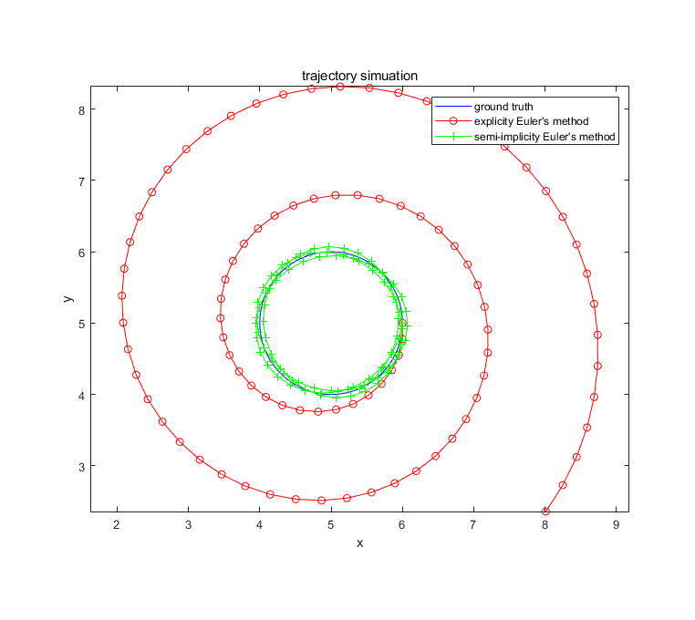

# physic_simulation_euler_method
# 物理模拟 显式/半隐式欧拉法 demo

## 简介 brief
simple explicit / semi-implicit euler method demo for physic simulation in game engine. This demo simulates the trajectory of a planet revolving around the sun, the gravity force is set to a const just for graph effect.

针对GAME104课程-物理系统模拟中提到的欧拉法，使用matlab复刻了课件中的简单行星公转demo，分别使用了显式和半隐式欧拉法模拟。为了显示的轨迹对比效果更佳，其中向心力大小设为恒定，未设为万有引力随距离变化。

## 效果展示 effect display

